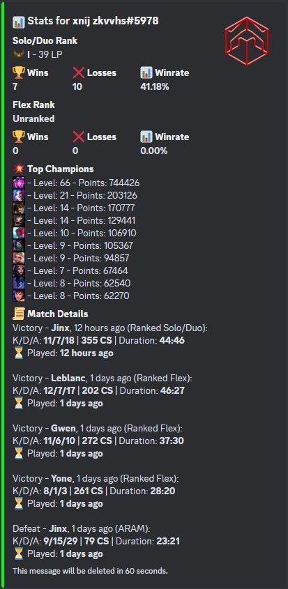
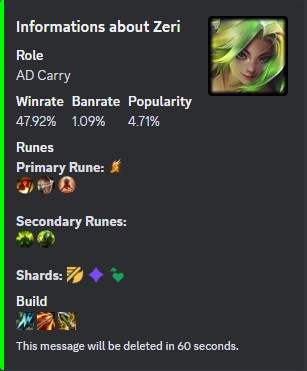
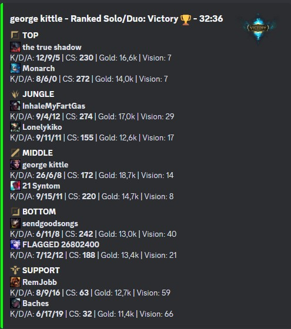
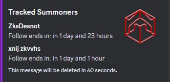

Stat Summoner Bot with Shuttle
==============================

This project is a Discord bot called **Stat Summoner**, built using the [Poise](https://docs.rs/poise) and [Serenity](https://docs.rs/serenity) libraries, and deployed using [Shuttle](https://docs.shuttle.rs/). The bot fetches and displays League of Legends statistics such as player rank, top champions, recent match data, and detailed champion information. It responds to custom commands and delivers information directly to the Discord server in an embed format.

Features
--------

-   Fetches **League of Legends player statistics** based on user input.
-   Shows **Solo/Duo and Flex rank** information.
-   Displays the **top champions** of a player and their mastery level.
-   Provides **match details** including K/D/A, farm, game result, and more.
-   Fetches detailed **champion information**, including roles, winrate, banrate, and recommended builds.
-   Allows users to **follow a player's games** for a specified duration.
-   Generates a **random champion** suggestion, optionally filtered by role.
-   Lists all **currently followed players** in the server.
-   Embeds information in a clear, formatted message in Discord.

Prerequisites
-------------

To run this bot, you need:

1.  A valid **Discord Token**.
2.  A **Riot Games API Key**.
3.  A **MongoDB URI** (for data storage).

Setup
-----

### Step 1: Create a Discord Application

1.  Log in to the [Discord Developer Portal](https://discord.com/developers/applications).
2.  Click the **New Application** button, give your application a name, and click **Create**.
3.  Navigate to the **Bot** tab on the left-hand menu, and add a new bot.
4.  On the bot page, click the **Reset Token** button to reveal your token. Copy this token and store it in your `Secrets.toml` file. Do not share this token with anyone.
    -   Make sure you add `Secrets.toml` to your `.gitignore` to keep it out of version control.
5.  Enable **Message Content Intent** and **Server Members Intent** on the bot page if required.

### Step 2: Generate an Invite Link

1.  On the application page, navigate to **OAuth2** in the left-hand panel.
2.  Go to the **URL Generator**, select the `bot` and `applications.commands` scopes.
3.  Under **Bot Permissions**, select the necessary permissions for your bot such as `Send Messages`, `Embed Links`, and `Use Slash Commands`.
4.  Copy the generated URL and use it to invite the bot to your Discord server.

### Step 3: Set Up the Riot API

1.  Go to the [Riot Developer Portal](https://developer.riotgames.com/) and create an API Key.
2.  Add your Riot API Key to the `Secrets.toml` file.

### Step 4: Set Up MongoDB

1.  Create a MongoDB cluster using [MongoDB Atlas](https://www.mongodb.com/cloud/atlas) or use your own MongoDB instance.
2.  Obtain your MongoDB connection URI.
3.  Add your MongoDB URI to the `Secrets.toml` file.

### Step 5: Deploy with Shuttle

1.  Install Shuttle CLI if you haven't already. Follow the [Shuttle documentation](https://docs.shuttle.rs/).

2.  To deploy your bot, simply run:

    bash

    Copier le code

    `shuttle deploy`

3.  Make sure your `Secrets.toml` file contains `DISCORD_TOKEN`, `RIOT_API_KEY`, and `MONGODB_URI`.

Configuration
-------------

Ensure all your secrets are correctly set in your `Secrets.toml` file or environment variables.

Available Commands
------------------

### `/lolstats`

Fetch and display League of Legends player statistics by allowing the user to input their game name and tag. The bot retrieves information such as:

-   **Solo/Duo rank** and **Flex rank**.
-   **Top champions** with their mastery level and points.
-   **Recent match details** (kills, deaths, assists, farm, game result).

**Usage:**

1.  Invoke the command: `/lolstats`.
2.  A modal will appear asking for your game name and tag line.
3.  After submitting, the bot will display your stats.

**Example Output:**

### `/championsinfos`

Fetch detailed information about a specific League of Legends champion.

-   **Displays**:
    -   **Roles**
    -   **Winrate**, **Banrate**, and **Popularity**
    -   **Recommended Runes** (with emojis)
    -   **Core Item Build** (with emojis)

**Usage:**

1.  Invoke the command: `/championsinfos`.
2.  A modal will appear asking for the champion's name.
3.  After submitting, the bot will display the champion's information.

### `/followgames`

Start following a player's games for a specified duration (between 1 and 48 hours).

-   **Tracks** the player's matches and can provide updates or notifications.

**Usage:**

1.  Invoke the command: `/followgames`.
2.  Select your region from the provided options.
3.  A modal will appear asking for the player's game name, tag line, and the duration to follow (in hours).
4.  After submitting, the bot will start tracking the player's games.

**Notes:**

-   Useful for monitoring a friend's gameplay or tracking high-elo players.
-   The bot stores the tracking information in the database.

### `/randomchampions`

Generates and displays information about a random champion.

-   **Optionally** filters the random selection by a specified role.

**Usage:**

1.  Invoke the command: `/randomchampions`.
2.  Optionally, select a role (Top, Jungle, Mid, ADC, Support).
3.  The bot will display information about a randomly selected champion fitting the criteria.

Displays the list of summoners currently being followed in the Discord server.

**Usage:**

1.  Invoke the command: `/whoisfollowed`.
2.  The bot will display a list of all players being tracked, along with the remaining follow time.

Documentation
-------------

The full Rust documentation for the project is available [here](https://shvvkz.github.io/stat-summoner/).

Additional Resources
--------------------

-   [Poise Documentation](https://docs.rs/poise)
-   [Serenity Documentation](https://docs.rs/serenity)
-   [Riot Games Developer Portal](https://developer.riotgames.com)
-   [Shuttle Documentation](https://docs.shuttle.rs)
-   [MongoDB Atlas](https://www.mongodb.com/cloud/atlas)

License
-------

This project is licensed under the terms of the [MIT license](./LICENSE).

* * * * *

**Note:** Always ensure that your `Secrets.toml` file is kept secure and is not committed to version control. Use `.gitignore` to prevent sensitive information from being exposed.